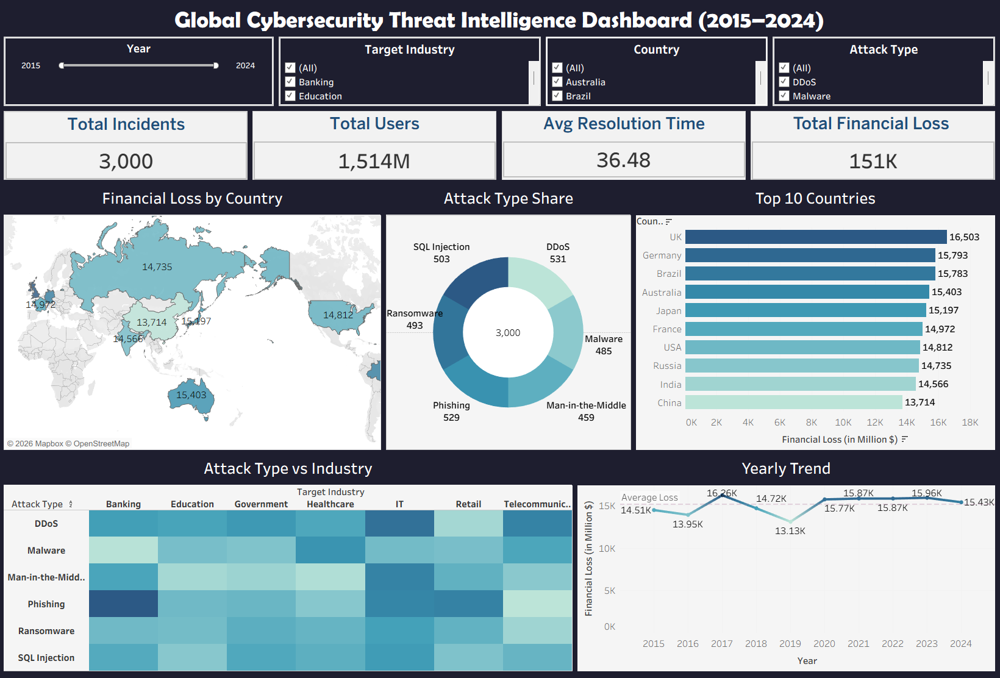
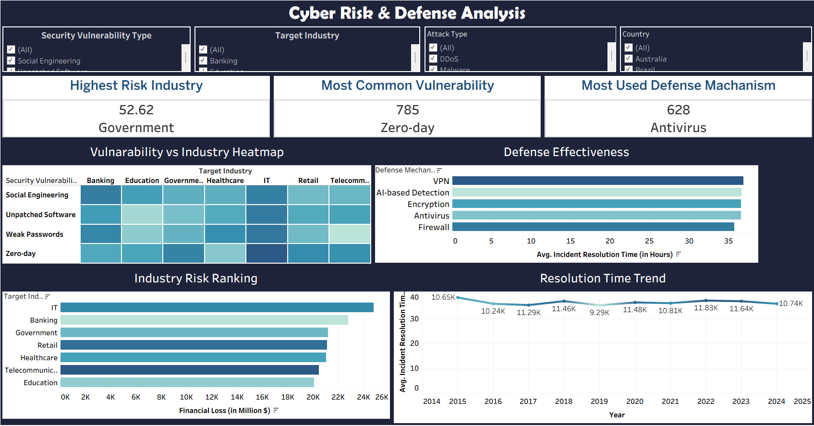
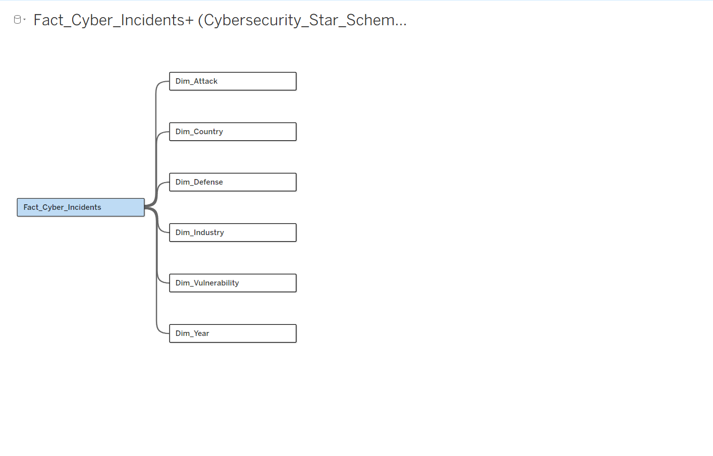

# 🛡️ Global Cybersecurity Threat Intelligence Dashboard (2015-2024)

## 📌 Project Overview

This project is an interactive Tableau dashboard developed to analyze global cybersecurity threats from 2015 to 2024. It provides insights into cyber attacks, attack types, targeted industries, financial losses, vulnerabilities, and geographic trends through interactive visualizations.

---

## 🛠 Tools Used

* Tableau
* Microsoft Excel / CSV
* Data Cleaning
* Data Visualization
* Interactive Dashboards

---

## 📊 Dashboard Features

* Interactive Filters
* KPI Cards
* Trend Analysis
* Country-wise Threat Analysis
* Attack Type Analysis
* Industry-wise Attack Analysis
* Financial Loss Analysis

---

## 📈 Key KPIs

* Total Cyber Attacks
* Total Financial Loss
* Most Targeted Industry
* Most Common Attack Type
* Year-wise Threat Trend
* Country-wise Attack Distribution

---

## 🖼 Dashboard Screenshots

### Dashboard

### Threat Analysis

### Data Overview

---

## 💡 Key Insights

* Identifies the most targeted industries worldwide.
* Highlights major cybersecurity attack patterns.
* Shows financial impact of cyber threats.
* Tracks year-wise cybersecurity incidents.
* Supports data-driven security strategy analysis.

---

## 📂 Files Included

* Tableau Dashboard (.twb)
* Dataset (.csv/.xlsx)
* Dashboard Screenshots
* README Documentation

---

## 👨‍💻 Author

**Prashik Meshram**

Aspiring Data Analyst

**SQL | Python | Power BI | Tableau | Excel**
